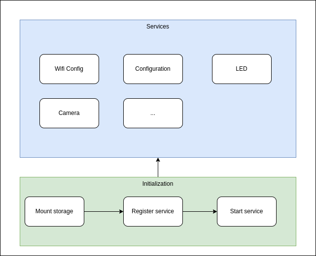

# esp32-cam
Demo for esp32-cam thinkAI

## Bring up device

<figure class="image">
  
  <figcaption>Esp device bring up</figcaption>
</figure>


## Get started

Download the esp32-cam repository from [GitHub](https://github.com/mbedProteus/esp32-cam) following to the command:
```bash
git clone https://github.com/mbedProteus/esp32-cam.git --recursive-submodules
```

Set up the environment for current terminal

1. Open the command line window.
2. Run the following script to download and install the Espressif toolchain for your platform (This step can ignore if you ran the install script before)
    ```bash
    ./sdk/esp-idf/install.sh
    ```
3. Add the ESP-IDF toolchain tools to your terminal's path with the following command.
    ```bash
    source sdk/esp-idf/export.sh
    ```
Establish a serial connection.
1. Normally, the Ubuntu Host PC will receive the USB to UART device without installing any more. If the device driver of USB device is not ready, please using dmesg command to know the USB device type and install the right driver.
2. After you establish a serial connection, make a note of the serial port for your board's connection. You need it to flash the demo.

To build the project, run the following `idf.py` commands.
```bash
idf.py set-target <target board>
```

```bash
idf.py build
```

To flash the application to your board, run the following command.
```bash
idf.py flash -p <serial port name>
```
